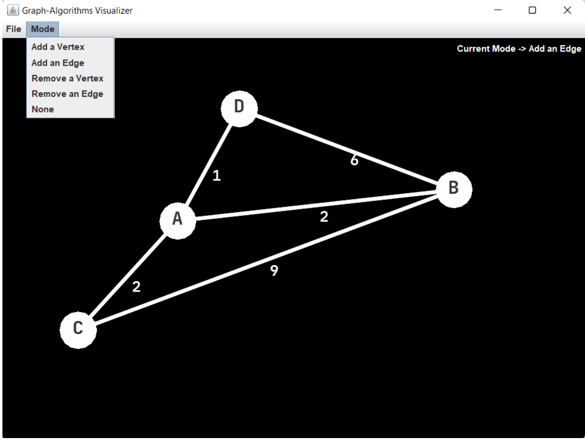
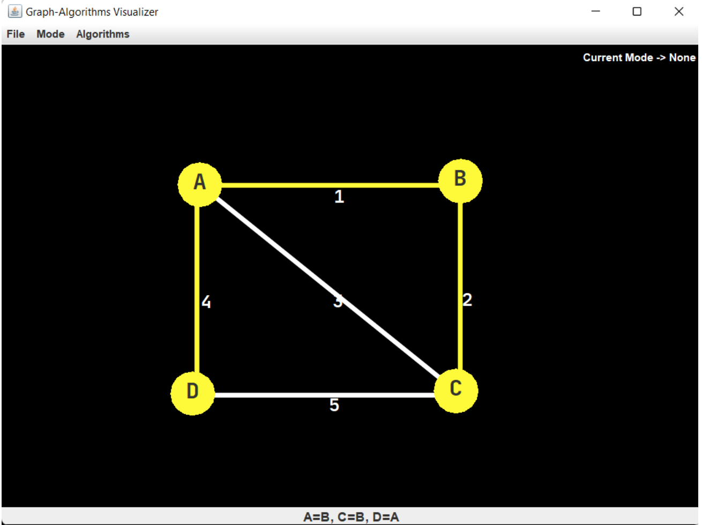

# Graph Algorithms Visualizer

**Description**

This project is Java GUI application, which allow you work with graphs. Create _vertices_ and connect them by _edges_, visualize graph algorithms like traversals, spanning trees, and shortest path-findings.

**Requirements**

1. Create Vertex Mode: user can create the vertex with special name by clicking on main panel
2. Create Edge Mode: user can connect vertices by clicking on two vertices. He can create the weighted edges. If try to connect vertices which already had edge, program update the weight of this edge.
3. Remove Edge Mode: user can remove edge between vertices by clicking on edge.
4. Remove vertices:  user can remove vertices by clicking on them. Also program automatically remove all its edges.
5. New mode: user can clear panel.
6. None mode: user cannot do something on main panel.

**Graph Algorithms**
- _Depth-first search (DFS)_ is an algorithm for traversing or searching tree/graph data structures. The algorithm starts at the root node and explores it as far as possible along each branch before backtracking. In the case of a graph, it can select any node.
- _Breadth-first search (BFS)_ algorithm traverses a graph by the breadth and uses a queue to get to the next vertex and to start a search when a dead end occurs in any iteration.
- _Dijkstra's algorithm_ allow to find the shortest path between selected vertex and other vertices.
- _Prim's algorithm_ for a minimum spanning tree (MTS). MTS is a subset of the edges of a connected edge-weighted undirected graph. It connects all graph vertices with the minimum possible total edge weight without cycles.

**Launch**

Clone this repository and run command `mvn package -PRun` in terminal.

